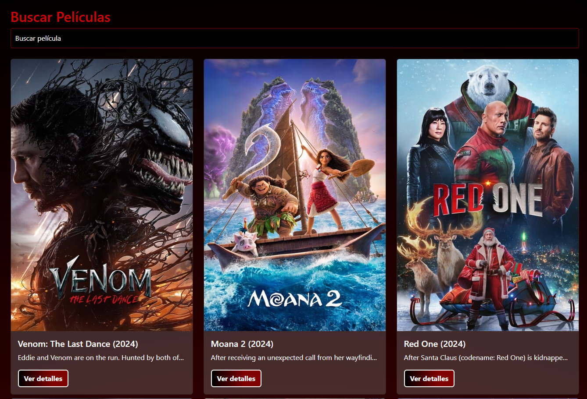
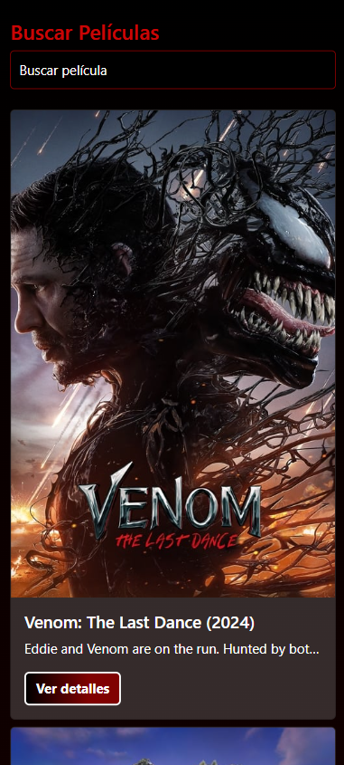
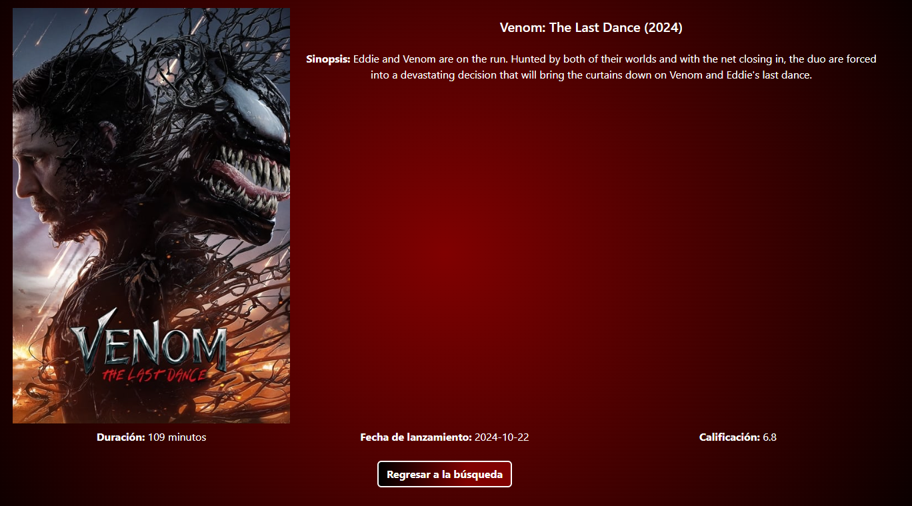
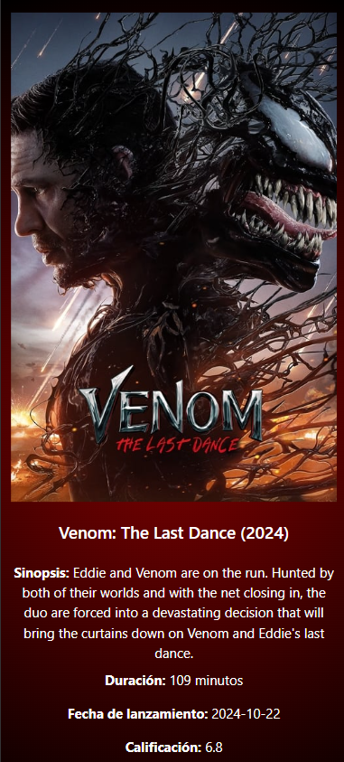

# GML Movies App

**GML Movies App** es una aplicación web desarrollada con **Angular** y **bootstrtap**, que permite a los usuarios buscar películas y ver detalles de cada una. La app utiliza la API de **The Movie Database (TMDb)** para obtener información sobre las películas.

## Funcionalidades

- **Búsqueda de películas**: Permite al usuario buscar películas por título.
- **Paginación**: Lista los resultados de búsqueda en un paginador que permite navegar entre las páginas de resultados.
- **Detalles de película**: Al seleccionar una película, el usuario puede ver más detalles sobre ella, como su sinopsis e imagen.
- **Responsive**: La aplicación se adapta a diferentes tamaños de pantalla, mostrando las tarjetas de películas en una fila o una columna dependiendo del dispositivo.

## Tecnologías utilizadas

- **Angular**: Framework principal para la construcción de la aplicación.
- **Bootstrap**: Para el diseño responsive y la maquetación rápida de la aplicación.
- **TMDb API**: Para obtener los datos de las películas.
- **SCSS**: Para los estilos personalizados.

## Instalación

### Requisitos

Antes de comenzar, asegúrate de tener los siguientes requisitos instalados:

- **Node.js** (versión 14 o superior)
- **Angular CLI**
- **NPM**

### Pasos para instalar

1. Clona este repositorio en tu máquina local:
   git clone https://github.com/tu_usuario/gml-movies-app.git

2. Navega a la carpeta del proyecto:
    cd gml-movies-app

3. Instala las dependencias del proyecto:
    npm install

4. Asegúrate de tener una API Key de TMDb y agrega la URL base de imágenes en el archivo de entorno `src/environments/environment.ts`
    export const environment = {
        production: false,
        apiUrl: 'https://api.themoviedb.org/3',
        apiKey: 'tu_api_key_aqui',
        imagesUrl: 'https://image.tmdb.org/t/p/w500'
    };

5. Ejecuta el servidor de la aplicación
    ng serve

6. Abre la aplicación en un navegador en la url localhost `hhtp://localhost:4200` o el puerto que tengas configurado

## Estructura del proyecto
- **src/app/pages/search:** Componente para buscar películas.
- **src/app/pages/details:** Componente para mostrar detalles de una película seleccionada.
- **src/app/services/movie.service.ts:** Servicio para interactuar con la API de TMDb.
- **src/environments/environment.ts:** Configuración de entorno donde se agregan la URL de la API y las claves.

## Capturas de pantalla

